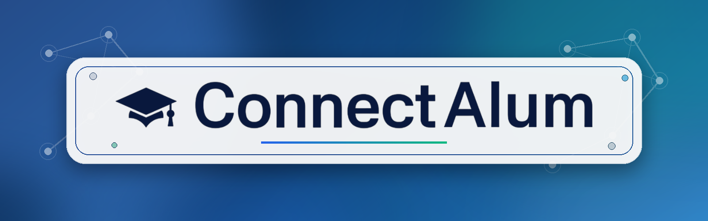

<div align="center">
  
  <h1>🎓 ConnectAlum</h1>
  <p><strong>Building meaningful connections in tech education bridging the gap between Students and Alumni</strong></p>
  
  <p>
    <a href="#-about-the-project">About The Project</a> •
    <a href="#-key-features">Key Features</a> •
    <a href="#%EF%B8%8F-tech-stack">Tech Stack</a> •
    <a href="#-screenshots">Screenshots</a> •
    <a href="#-installation--setup">Installation</a> •
    <a href="#-contact">Contact</a>
  </p>
</div>

---

## 📖 About The Project

**ConnectAlum** is a comprehensive full-stack platform (MERN) designed to foster mentorship, career advancement, and professional networking. It solves a crucial problem in academic institutions by creating an interactive directory and engagement platform where current students can seek guidance, request mentorship, track applications, and communicate in real-time with graduated alumni.

Unlike simple directories, ConnectAlum is built with a **real-world, robust architecture**:
- Includes role-based dashboards (Student vs. Alumni).
- Features real-time stat-tracking, analytics, and notification banners.
- Includes integrated bi-directional messaging systems mirroring production-ready applications.
- Boasts a premium, glassmorphism UI with micro-interactions, CSS animations, and polished scalable layouts.

## ✨ Key Features

### 👨‍🎓 For Students
* **Mentorship & Appointments:** Send mentorship requests to alumni. Once accepted, students can book scheduled appointments immediately.
* **Real-time Notifications:** Receive live dashboard alerts when an alumni accepts/rejects requests or sends a message.
* **Job & Internship Board:** Browse exclusive opportunities posted directly by the alumni network.
* **Direct Messaging:** Seamless, persistent, and secure chat interface to talk directly with connected mentors.
* **Smart Dashboard:** Comprehensive overview of upcoming appointments, recommended mentors, and career progress.

### 💼 For Alumni
* **Advanced Analytics Dashboard:** Live tracking of "Students Connected," "Pending Requests," total interactions, and weekly engagement bar charts.
* **Live Student Request Management:** Accept or decline student mentorship requests directly from the portal securely.
* **Profile Management:** Fully customizable profiles for managing expertise, skills, availability, and professional summaries.
* **Post Opportunities:** Share exclusive jobs and internships with the student body directly.
* **Real-time Synchronization:** Instantly updates analytics and sidebar notification badges when interactions happen without a page reload.

## 🛠️ Tech Stack

<div align="center">
  
  
  
  
</div>
<div align="center">
  
  
  
  
</div>

<br/>

### Frontend Architecture
* **Framework:** React.js
* **Styling & UI:** Vanilla CSS with custom utility components, Glassmorphism design principles, advanced `@keyframes` animations.
* **State Management:** React Context API

### Backend Architecture
* **Environment:** Node.js, Express.js
* **Database:** MongoDB (via Mongoose)
* **Authentication:** JWT (JSON Web Tokens) & bcryptjs for secure password hashing.
* **Security:** Role-based access control middleware verifying 'student' vs 'alumni' API access.

---

## 📂 Repository Structure

```text
connectalum/
├── backend/                  # Node.js + Express Backend
│   ├── config/               # Database and environment configurations
│   ├── controllers/          # Business logic and request handlers (e.g., users, messaging)
│   ├── middleware/           # Auth and role-based access control filters
│   ├── models/               # Mongoose schemas (User, Message, Appointment, etc)
│   ├── routes/               # API route definitions
│   └── server.js             # Main server entry point
│
├── frontend/                 # React.js Frontend
│   ├── public/               # Static assets
│   └── src/
│       ├── assets/           # Images, SVGs, and global styles
│       ├── components/       # Reusable UI components (Navbar, Cards, Buttons)
│       ├── context/          # React Context providers (Global state)
│       ├── layouts/          # Page wrappers (AlumniLayout, StudentLayout)
│       ├── pages/            # Main views (Dashboard, Analytics, Messages, Profile)
│       ├── App.jsx           # Main React component
│       └── main.jsx          # Frontend entry point
│
├── .gitignore
└── README.md
```

---

## 📸 Screenshots

*(Add your screenshots here)*

### 1. Student Dashboard

<br/>

### 2. Alumni Analytics Dashboard

<br/>

### 3. Mentorship & Real-Time Messaging Interface

<br/>

### 4. Live Notifications System

<br/>

---

## 🚀 Installation & Setup

To get a local copy up and running, follow these steps.

### Prerequisites
* npm and Node.js
* MongoDB instance (Local or Atlas)

### Setup

1. **Clone the repository:**
   ```bash
   git clone https://github.com/yourusername/connectalum.git
   cd connectalum
   ```

2. **Backend Setup:**
   ```bash
   cd backend
   npm install
   ```
   Create a `.env` file in the `backend` directory and add your variables:
   ```env
   PORT=5000
   MONGODB_URI=your_mongodb_connection_string
   JWT_SECRET=your_jwt_secret_key
   ```
   Start the backend server:
   ```bash
   npm run dev
   ```

3. **Frontend Setup:**
   ```bash
   cd frontend
   npm install
   ```
   Create a `.env` file (if applicable) for the frontend or point Axios URLs to your local backend.
   Start the frontend application:
   ```bash
   npm start
   ```

4. **Enjoy the platform:**
   Navigate your browser to `http://localhost:3000`

---

## 👤 Author Details

**Karan Nayal**  
*Full-Stack Software Developer & Engineer*

Hello! I am Karan Nayal, the developer behind ConnectAlum. I built this platform out of a passion for connecting aspiring students with established industry professionals. My goal was to create not just functional software, but a polished, secure, and highly responsive ecosystem that looks and feels like modern SaaS products.

* **GitHub : ** [Karan Nayal](https://github.com/kiyansh13karan) 
* **LinkedIn : ** [Karan Nayal](https://www.linkedin.com/in/karan-nayal-054981286/) 
* **Email : ** [karannayalkannu1982@gmail.com](mailto:[EMAIL_ADDRESS]) 

<div align="center">
  <p>⭐ If you found this project helpful or interesting, please consider starring the repository! ⭐</p>
</div>
